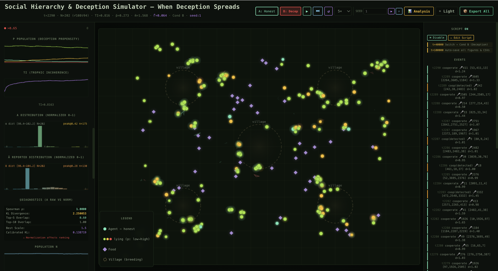

# ALife2026-Deception-Hierarchy



A multi-agent simulation framework for studying hierarchy formation, cooperation, and deception in evolving populations.

---

## Overview

This repository contains the implementation of the simulation model presented in:

**When Deception Learns: The Destabilization of Social Hierarchy in an Adaptive Population**

(accepted at ALIFE 2026)

The model investigates how deceptive behaviour emerges, spreads, and influences the stability of hierarchical social structures in a population of adaptive agents.

The framework combines:

* Multi-Agent Systems (MAS)
* Evolutionary dynamics
* Cooperative decision-making
* Hierarchy emergence
* Deception evolution
* Social learning
* Trophic Incoherence analysis

---

## Research Questions

This project addresses the following questions:

### RQ1

How do stable hierarchical structures emerge from populations with only minimal initial differences?

### RQ2

Under what conditions can deceptive behaviour evolve and spread through a population?

### RQ3

To what extent can deception destabilise an already-established hierarchy?

---

## Model Components

### Agents

Each agent possesses:

* Innate capability
* Energy
* Age
* Gender
* Cooperation history
* Deception propensity
* Deception magnitude

### Cooperation

Agents may form temporary teams to complete cooperative tasks and acquire resources.

### Speaker Selection

Leadership emerges through probabilistic speaker selection based on perceived capability.

### Deception Evolution

Deceptive behaviour evolves through:

* Self-reinforcement
* Observational learning
* Vertical inheritance

### Reproduction

Successful agents reproduce and pass traits to offspring through inheritance and mutation.

### Hierarchy Evaluation

Emergent social structure is analysed using:

* Trophic Incoherence (TI)
* Leadership frequency
* Capability distributions
* Cooperation networks

---

## Simulation Workflow

```text
Initial Population
        ↓
Agent Interaction
        ↓
Cooperation
        ↓
Speaker Selection
        ↓
Resource Allocation
        ↓
Deception Learning
        ↓
Reproduction & Mutation
        ↓
Hierarchy Evolution
        ↓
Network Analysis
```

---

## Repository Structure

```text
ALife2026-Deception-Hierarchy/

├── src/
│   └── App.jsx
│
├── public/
│
├── package.json
├── package-lock.json
├── vite.config.js
├── LICENSE
└── README.md
```

---

## Installation

Clone the repository:

```bash
git clone https://github.com/ShanshanMao999/ALife2026-Deception-Hierarchy.git
```

Install dependencies:

```bash
npm install
```

---

## Running the Simulation

Start the local development server:

```bash
npm run dev
```

The simulation will open in your browser.

---

## Experimental Conditions

The framework currently includes two experimental conditions:

### Condition A

Honest Baseline

All agents report information truthfully.

### Condition B

Evolvable Deception

Agents may learn, spread, and inherit deceptive behaviour.

---

## Outputs

The simulation records:

* Population size
* Trophic Incoherence (TI)
* Cooperation events
* Leadership frequencies
* Capability distributions
* Deception dynamics
* Network structure statistics

---

## Example Simulation

Insert a screenshot here.

```markdown

```

---

## Citation

If you use this repository, please cite:

```bibtex
@inproceedings{mao2026deception,
  title={When Deception Learns: The Destabilization of Social Hierarchy in an Adaptive Population},
  author={Mao, Shanshan},
  booktitle={Artificial Life Conference (ALIFE 2026)},
  year={2026}
}
```

---

## License

This project is released under the MIT License.

See the LICENSE file for details.

---

## Contact

Email: shanshanmao5233@gmail.com
Email: sxm1550@student.bham.ac.uk

University of Birmingham

GitHub:
https://github.com/ShanshanMao999
